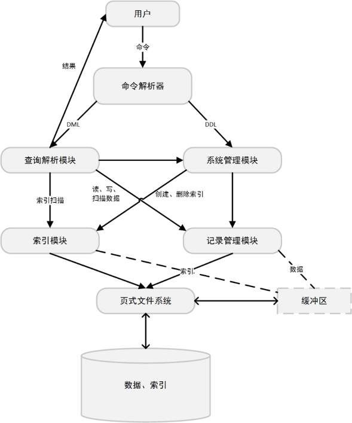

# 数据库项目 报告文档

2017.1.10 王润基 朱书聪

## 运行方法

本项目用C++开发，使用CMake构建，用GoogleTest进行单元测试

```bash
mkdir build
cd build
cmake -DCMAKE_BUILD_TYPE=Release ../
make
./DbProject
./Test # Run unit test
```

## 实现功能

* 简单的关系数据库管理系统

  * 支持数据库的添加、删除、切换、查看
  * 支持表项的插入、删除、更新、查找
  * 局限：单用户，单线程

* 实现细节

  * 命令行解析器
  * 构建于页式文件系统上
  * 定长记录存储，支持INT、CHAR、FLOAT、DATE数据类型
  * 支持单属性的B+树索引
  * 支持主键、外键、可空、唯一约束

* 附加功能

  * 外键约束
  * 模糊查询

* 具体SQL语句

  详见`SQLSpec.md` 

## 系统结构设计

架构基本参照官方版，大致分为：

* 页式文件系统（在提供代码的基础上进行C++包装）
* 记录模块：在页式文件系统上实现管理定长数据的集合
* 索引模块：在页式文件系统上实现B+树索引
* 系统管理模块：数据库和表信息维护
* 查询解析模块：记录的增删改查
* 解析器模块：解析SQL字符串并调用内部接口



src下的文件结构基本与架构保持一致：

* filesystem：页式文件系统
* record：记录模块，RecordSet类为主
* index：索引模块，Index类为主
* system：系统模块，Database类为主
* query：查询模块，仅包含跨表查询功能，其它单表命令在Table类中
* table：单表增删改查操作，Table类为主
* ast：全局定义，规定parser和内部交互的数据格式
* parser：SQL解析器
* driver：命令行前端
* util：一些没有用上的辅助模块

test下有一部分同名的目录，为对应模块的单元测试

## 页存储结构

详见`FileFotmat.md`

## 主要模块设计

重点介绍附加功能实现原理

### 页式文件系统

#### Page类

封装BufPageManager。一个Page对象管理一个页的资源。只能通过Database类获取，供内部模块使用。

提供两种方法获取页内容：

* getDataReadonly()：getPage同时access
* getDataMutable()：getPage同时markDirty

*注：设计初衷是当Page对象存在时保证内容一定在缓存中，每次getData都不需要getPage，析构时自动释放资源。经测试会出错，因此采用当前保守的方法。*

### 记录模块

TODO

### 索引模块

基于最简单实现原则，索引模块的实现特点如下：

* 只实现非簇集索引，不实现簇集索引。

  这样它便独立于记录模块，降低耦合和复杂度。

* 将键值对打包处理，以支持重复元素。

  代价是在中间节点也要存储RID，降低了容量。

  另一种实现是在页节点挂链表，这个也实现了（详见IndexEntityLists类）。但由于其在管理和查找上的复杂性，最终没有采用。

#### IndexPage结构

定义一个B+树节点在页中的存储结构，size==8192。

扮演B+树节点的角色。内部维护一个元素的数组，支持插入、删除、查找等基本操作。节点初始化、合并、分裂也在此进行。

#### SysIndexPage结构

定义系统索引表在页中的存储结构，size==8192。

全局唯一，记录每个索引的元信息。

#### Index类

一个索引。

支持插入、删除、查找元素，二分查找并获取迭代器操作。必要时自动分裂或合并节点。

B+树的核心算法在此实现，它关注节点之间的互动，不必关心一个节点的存储细节（已经由IndexPage封装好）。

#### IndexIterator类

索引迭代器。只能从Index类获取。

只支持单向移动。

#### IndexManager类

索引管理器。是索引模块对外的入口类。

支持创建、删除、获取索引，负责管理SysIndexPage中的信息。

#### ※IndexEntityLists类

基于记录模块的链表群管理器。原计划用于保存索引中相同值的RID链表。

支持创建、删除链表，并在链表中插入、删除、查询元素。

实现方式是封装了一个RecordSet，每个元素是一个链表节点。因此它占用一个全局的RecordSet，名为`**IndexEntityList**`

这个类作为遗留代码保留下来，测试依然有效。

### 系统模块

#### DatabaseMetaPage结构

定义了数据库元信息页的存储结构。size==8192

#### DatabaseManager类

数据库管理器，单例模式。

支持数据库的创建、删除、查找、切换，并管理页式文件系统。

#### Database类

数据库主类。对外提供全部服务接口，是内部与解析器沟通的唯一对象。

内部控制三个模块的管理类，为它们提供页管理的功能。

对外提供创建、删除、获取表和索引，以及接收命令和查询的接口，委托给内部三个模块执行。

### 查询模块

#### TableRecord类

一条表项/记录。是若干值的列表。

支持获取特定位置的值及其类型。其中“值”的类型是`vector<unsigned char>`，作为数据容器。

支持向列表尾push一个值（用于解析器），或从string解析（用于测试）。

*注：由于数据类型和大小的动态性，这个类的数据存在堆空间上，因此大量创建对象会引发频繁的new操作。可考虑用全局内存池等解决。*

#### TableRecordRef类

一条引用表内部数据的表项/记录。提供和TableRecord完全相同的读取接口。

#### TableMetaPage结构

定义了表元信息页的存储结构。size==8192

实现了和TableDef结构的互转。

#### Table类

一个表。是查询模块的实际主类。

支持插入、删除、更新、查找元素，分别对应INSERT、DELETE、UPDATE、SELECT命令。实现了查询模块除多表查询外的全部核心算法。

以下选取几方面介绍它的实现细节：

* 记录过滤（where语句）`filterThenForeach()`

  首先遍历所有条件，找到可用索引优化的一个。如果存在，则获取索引迭代器，取出所有符合条件的RID集合，然后依次获取表项。否则直接遍历RecordSet的全部元素。`selectWithIndex()`

  在遍历表项之前，需要根据剩下的条件们，来生成一个predict函数判断元素是否符合条件。（类似的，对于UPDATE操作也会生成对应的set函数）`makePredict()`

  然后就可以遍历元素，调用predict函数过滤，再执行其它操作了。

  *注：上述两个过程涉及大量的判断，应用了很多宏，导致编译速度很慢，因此分离到另一个文件中。*

* 插入过程

  * 单表项检查

    保证类型匹配，大小不超，满足可空约束。

  * 唯一性检查

    首先用`std::set<Data>`建立临时索引

    枚举每个有唯一性约束的属性：

    * 若没有索引，则先把它们取出来，扔到set中
    * 若有索引，则取出索引，之后可直接查询它

    然后遍历要插入的元素，检查set和索引（如有）中是否有重复项，然后把值加入set中。

    **特别地，对于复合主键需特别处理：**

    出于简单原则，索引不支持多属性（尽管简单的数据拼接就可以）。

    做法是对复合主键进行Hash，扔到临时索引中检查。

  * 插入集合

  * 插入索引

#### QueryManager类

查询模块的主类。

接收处理INSERT、DELETE、UPDATE命令，接收SELECT命令并返回结果。

由于单表操作都委托给Table类，实际它只承担多表查询的任务。

* 朴素多表连接算法
  * 扫描where语句，找出每个表相关的属性名，加入select中
  * 对每个表分别SELECT，where和select列表要进行过滤（所有涉及两个表的判断条件都被过滤掉）
  * 按结果大小升序排序，然后依次连接两个表
  * 每次连接之后，找出新生效的判断条件，进行一次过滤
  * 用原始的select进行一次投影
* 为外键优化的两表连接算法
  * 扫描where语句，找到外键约束的条件：t1.pk == t2.fk。否则转用上面的算法。
  * （同上）扫描where语句，找出每个表相关的属性名，加入select中
  * 对t2表进行SELECT
  * 从where中筛选出只含t1的条件集合，记为ws
  * 枚举t2查找结果的每个元素，取出外键的值v，将新条件`t1.pk==v`加入ws成为ws1，用它对t1表进行SELECT，结果应为空或1个元素。如果是1个元素，则把它与t2的表项连接，加入结果集合中。
  * 扫描where语句，找出所有涉及两个表的条件，对结果进行一次过滤。
  * （同上）用原始的select进行一次投影

类似Table类，这里也需要生成predict函数。不同的是：生成时需要查找属性名对应的列编号，然后直接访问TableRecord的接口获取数据即可。

### 解析模块


## 实验结果


## 分工

王润基：索引模块，系统模块（表相关），查询模块

朱书聪：记录模块，系统模块（管理相关），SQL解析器

## 参考文献

* https://web.stanford.edu/class/cs346/2015